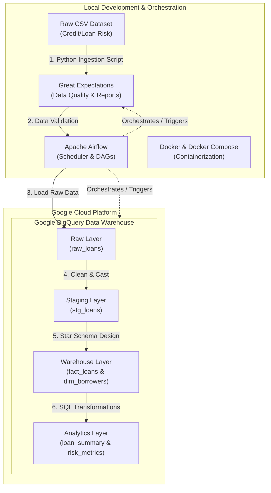

# Phase 0: Credit/Loan Risk Data Pipeline Overview

Welcome to the **Credit/Loan Risk Data Pipeline** project! This document serves as your reference guide for Phase 0. Here, we lay down the theoretical foundations of modern Data Engineering.

---

## 1. Core Data Engineering Concepts

### A. What is a Data Pipeline?
A **Data Pipeline** is a system of automated software steps that move data from one or more sources, transform it into a structured, clean, and enriched state, and load it into a destination system (such as a Data Warehouse or Data Lake) for analytics, reporting, or Machine Learning.
*   **Without a Pipeline:** Business analysts write manual SQL scripts, copy-paste CSVs, and run ad-hoc calculations. This is prone to human error, does not scale, and lacks monitoring.
*   **With a Pipeline:** Data flows automatically, errors are caught before they impact downstream reports, and performance is optimized.

### B. ETL vs. ELT
| Feature | ETL (Extract, Transform, Load) | ELT (Extract, Load, Transform) |
| :--- | :--- | :--- |
| **Workflow** | Data is extracted, transformed on a processing server (e.g. Spark/Python), and then loaded. | Data is extracted, loaded directly to the warehouse, and transformed inside it using SQL. |
| **Compute Location** | Separate processing cluster or engine. | The target Data Warehouse itself (e.g., BigQuery). |
| **Storage Strategy** | Only transformed data is loaded. Raw data is often discarded or archived separately. | Both raw and transformed data exist in the warehouse, enabling easy reprocessing. |
| **Scalability** | Limited by the processing server/cluster capacity. | Highly scalable, leverages cloud compute power. |
| **Modern Practice** | Used for legacy systems, sensitive data masking, or external API ingestions. | **Industry standard** for cloud data warehousing (Modern Data Stack). |

### C. Batch vs. Streaming
*   **Batch Processing:** Processes data in large blocks at scheduled intervals (e.g., every night at 2 AM, hourly, or weekly). 
    *   *Analogy:* Getting your mail once a day.
    *   *Use Case:* Monthly financial statements, risk profile updates, daily loan default calculations.
*   **Streaming Processing:** Processes data continuously, record by record, as soon as it is generated.
    *   *Analogy:* Receiving notifications in real-time on your phone.
    *   *Use Case:* Real-time fraud detection (stopping a card charge instantly), stock ticker updates.

---

## 2. Why Financial & Credit Risk Companies Need Data Pipelines
Credit and loan risk systems calculate key metrics to determine if a borrower should get a loan and how much interest they should pay.
1.  **Credit Scoring and Underwriting:** Models need clean data on debt-to-income (DTI) ratio, annual income, credit history, and employment.
2.  **Risk Mitigation:** Financial companies need to identify early warning signs of defaults. Bad data ingestion (e.g., registering a $100,000 income as $10,000) can cause the business to lose revenue or approve high-risk borrowers.
3.  **Auditing and Compliance:** Financial institutions are heavily regulated. Pipelines establish **data lineage**—the audit trail of where a metric came from and how it was calculated.

---

## 3. Project Architecture

Our architecture follows modern cloud-native ELT practices using local orchestration and cloud data warehousing.

### Architectural Breakdown:
1.  **Ingestion & Data Quality:** We ingest raw CSV data, validating schema integrity using **Great Expectations** before moving it further.
2.  **Orchestration:** **Apache Airflow** schedules, triggers, and monitors the tasks.
3.  **Data Warehouse (BigQuery):**
    *   **Raw Layer:** Exact replica of the source file (no transformations).
    *   **Staging Layer:** Cleaned data with proper types, handled nulls, and standardized strings.
    *   **Warehouse Layer (Star Schema):** Fact tables (transactions/loans) and Dimension tables (borrower profiles) to support high-performance queries.
    *   **Analytics Layer:** Pre-computed views and aggregates for business dashboards and risk analysts.
4.  **Containerization:** **Docker** wraps our pipeline to ensure it runs identically on your machine, a staging server, or production.
