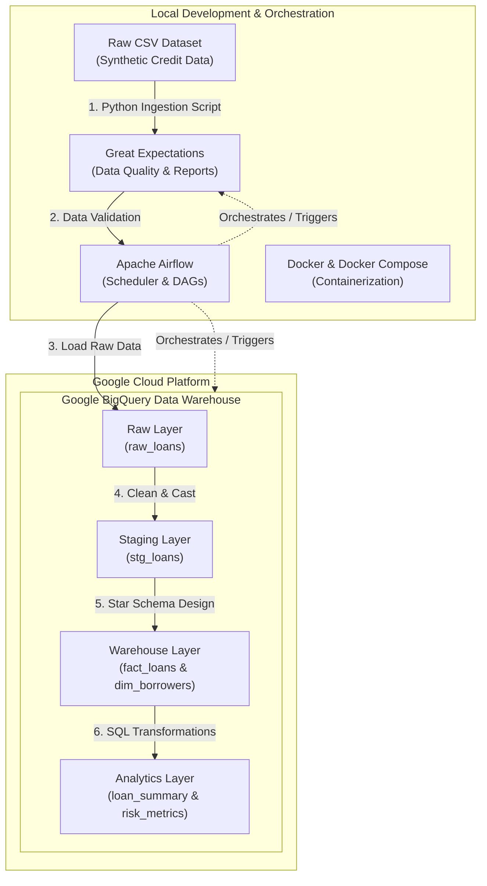

# Credit / Loan Risk Data Pipeline

An end-to-end, production-grade analytical data pipeline engineered to ingest, validate, clean, orchestrate, and load credit risk data into a Google BigQuery Data Warehouse.

---

## 🚀 Project Overview

This repository demonstrates the construction of an enterprise-grade **ELT Data Pipeline** designed for credit and loan underwriting analytics. The pipeline automates the transformation of raw applicant profiles into structured, validated Star Schema tables in the cloud, helping risk analysts compute applicant default rates and leverage statistics safely.



---

## 🛠 Tech Stack

*   **Orchestration:** [Apache Airflow 2.8](https://airflow.apache.org/) (TaskFlow API, DAGs, custom failure alerts, retries).
*   **Data Quality:** [Great Expectations 1.x](https://greatexpectations.io/) (Automated uniqueness, range, categorical, format validations and Data Docs).
*   **Data Warehouse:** [Google BigQuery](https://cloud.google.com/bigquery) (Storage, Compute, Partitioning, Clustering, SQL Analytical Views).
*   **Data Processing:** [Pandas](https://pandas.pydata.org/) & [Numpy](https://numpy.org/).
*   **Containerization:** [Docker & Docker Compose](https://www.docker.com/) (PostgreSQL Metadata DB, LocalExecutor workers).
*   **CI/CD & Testing:** [GitHub Actions](https://github.com/features/actions) & [Pytest](https://docs.pytest.org/).

---

## 📂 Repository Structure

```
Loan_Risk_Pipeline/
├── .github/workflows/       # GitHub Actions CI/CD workflows
├── config/                  # Configuration & logging settings
│   ├── config.yaml          # Global pipeline parameters
│   └── logging.yaml         # Structured rotating logger settings
├── dags/                    # Apache Airflow DAG files
│   └── loan_risk_dag.py     # Pipeline master DAG definition
├── data/                    # Local storage layers (Git ignored)
│   ├── raw/                 # Raw landed CSV source files
│   └── processed/           # Cleaned and engineered CSV files
├── gx/                      # Great Expectations context and suites
├── scripts/                 # Synthetic generator and profiling scripts
├── src/                     # Source code package
│   ├── __init__.py          # Marks src as a package
│   ├── ingestion.py         # Defensive CSV parsing and check scripts
│   ├── validation.py        # Great Expectations validation layer
│   ├── cleaning.py          # Imputations, deduplication, anomalies cleaning
│   ├── loader.py            # BigQuery load jobs (truncation, partitioning)
│   ├── transformation.py    # Star Schema splitter and local aggregates
│   └── utils/               # Common logging and helper utilities
├── tests/                   # Automated Pytest suite
├── Dockerfile               # Build file for Airflow container
├── docker-compose.yaml      # Multi-container orchestration settings
├── pyproject.toml           # Tool configs (pytest)
└── requirements.txt         # Pinned python packages list
```

---

## 📖 Guided Documentation

*   [Setup & Installation Guide (Setup.md)](file:///Users/shashi/Projects/Personal/Loan_Risk_Pipeline/Setup.md)
*   [Data Dictionary Glossaries (DataDictionary.md)](file:///Users/shashi/Projects/Personal/Loan_Risk_Pipeline/DataDictionary.md)
*   [Troubleshooting Guide (Troubleshooting.md)](file:///Users/shashi/Projects/Personal/Loan_Risk_Pipeline/Troubleshooting.md)
